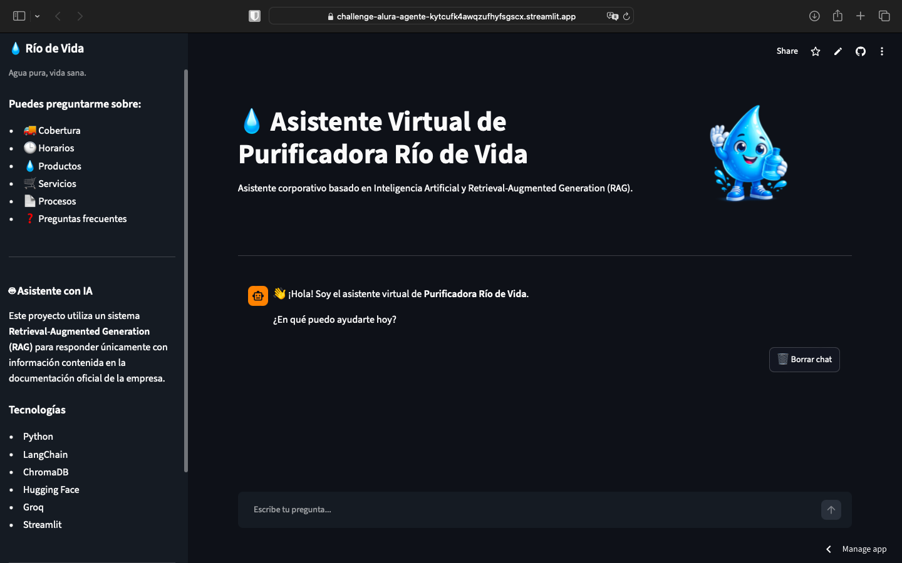
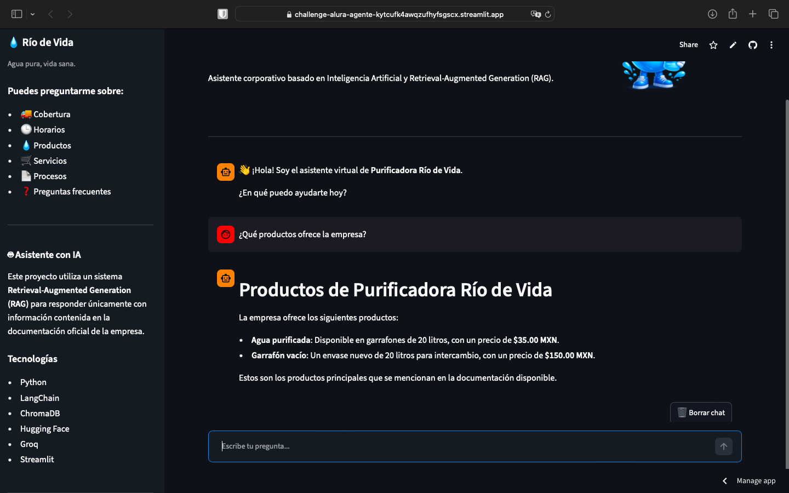
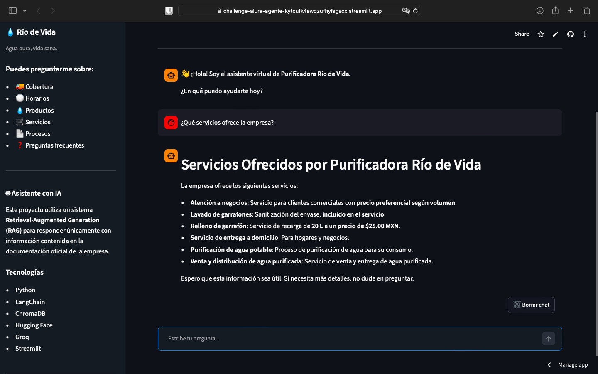
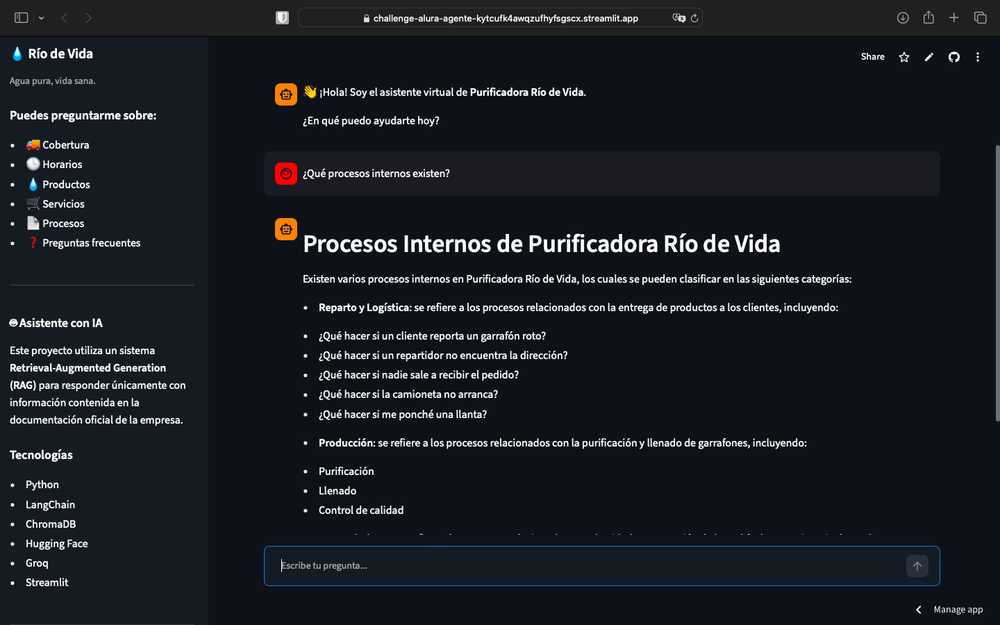
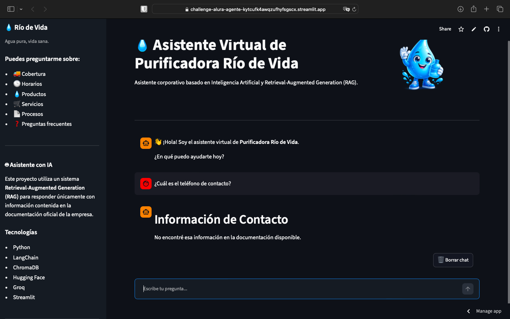
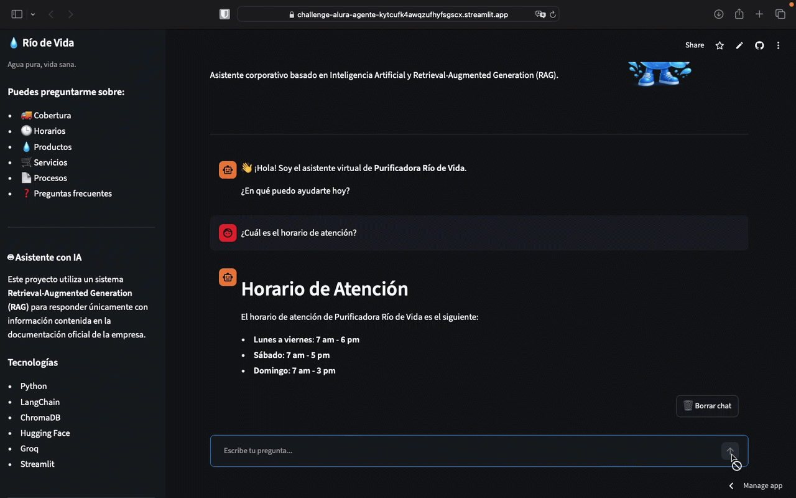

# 💧 Asistente Virtual de Purificadora Río de Vida


**Proyecto final — Challenge Alura Agente (Oracle Next Education / Alura Latam)**

Un asistente inteligente que responde preguntas en lenguaje natural sobre **Purificadora Río de Vida**, una empresa de purificación y distribución de agua en garrafones en Villahermosa, Tabasco, utilizando **RAG (Retrieval-Augmented Generation)** sobre su propia documentación (PDF y CSV).

---

## 🌐 Aplicación desplegada

Puedes probar la versión desplegada del proyecto aquí:

👉 https://challenge-alura-agente-kytcufk4awqzufhyfsgscx.streamlit.app

Repositorio:

👉 https://github.com/vaniasherel/Challenge-Alura-Agente

--- 

## 📖 Visión general

En lugar de depender del conocimiento general de un modelo de lenguaje, este asistente **recupera información real** desde los documentos oficiales de la empresa (perfil, preguntas frecuentes, procesos internos, catálogo de productos y rutas de reparto) y genera respuestas basadas únicamente en esa información — evitando inventar datos que no existen en la documentación.

---

## ✨ Características principales

- 📄 Ingesta automática de documentos PDF y CSV
- ✂️ División inteligente de texto en fragmentos (chunking)
- 🧠 Embeddings semánticos multilingües con Hugging Face (100% local, sin costo)
- 🔍 Base de datos vectorial con ChromaDB (generada automáticamente al iniciar la aplicación)
- 🤖 Generación de respuestas mediante Groq API utilizando Llama 3.3 70B Versatile
- 🚫 Prevención de alucinaciones: si la información no existe en la documentación, el asistente lo indica honestamente
- 🔀 Manejo de preguntas ambiguas: enumera todas las opciones relevantes en vez de elegir una al azar
- 💬 Interfaz web simple con Streamlit
- 💬 Interfaz conversacional tipo chat
- 🎨 Tema oscuro personalizado
- 💧 Identidad visual con mascota y diseño inspirado en agua
- 🗑️ Botón para reiniciar la conversación
- 📱 Diseño adaptable para pantallas amplias (layout wide)
- ✅ Suite de pruebas automatizadas (pytest) + casos de prueba documentados manualmente

---

## 🏛️ Arquitectura / Pipeline del sistema

```
Documentos de la empresa (PDF + CSV)
            │
            ▼
     PDF Loader / CSV Loader   (LangChain + Pandas)
            │
            ▼
     Text Splitter             (chunk_size=350, overlap=60)
            │
            ▼
     Embeddings                (Hugging Face · paraphrase-multilingual-MiniLM-L12-v2)
            │
            ▼
     ChromaDB                  (base vectorial)
            │
            ▼
     Retriever           (Semantic Search, k=15)
            │
            ▼
     LLM (Groq · Llama 3.3 70B)
            │
            ▼
     Interfaz Streamlit
```

---

## ⚙️ Tecnologías utilizadas

| Categoría | Tecnología |
|---|---|
| Lenguaje | Python 3.11 |
| Orquestación IA | LangChain |
| Modelo de lenguaje (LLM) | Groq (Llama 3.3 70B Versatile) |
| Embeddings | Hugging Face (`paraphrase-multilingual-MiniLM-L12-v2`) |
| Base de datos vectorial | ChromaDB |
| Carga de documentos | PyPDFLoader (LangChain Community), Pandas |
| Interfaz web | Streamlit (tema personalizado) | 
| Pruebas | Pytest |
| Gestión de secretos | python-dotenv |

---

## 📂 Estructura del proyecto

```
Challenge-Alura-Agente/
├── .streamlit/
│   └── config.toml             # Configuración del tema de Streamlit
│
├── assets/
│   └── gotita.png              # Mascota del asistente
│
├── data/
│   ├── pdf/                    # Documentación PDF de la empresa
│   └── csv/                    # Catálogo de productos y rutas
│
├── docs/
│   ├── images/                 # Capturas y GIF del proyecto
│   ├── Challenge-Alura.md      # Documentación técnica
│   └── PROJECT_STATUS.md       # Bitácora del desarrollo
│
├── src/
│   ├── loaders/                # Carga de PDF y CSV
│   ├── processing/             # División de documentos en chunks
│   ├── embeddings/             # Modelo de embeddings
│   ├── vectorstore/            # Creación del Vector Store (Chroma)
│   ├── rag/                    # Recuperación semántica (Retriever)
│   ├── llm/                    # Pipeline RAG + Groq
│   └── ui/                     # Interfaz Streamlit
│
├── tests/
│   ├── test_cases.md           # Casos de prueba manuales
│   ├── test_chat_model.py
│   ├── test_loaders.py
│   ├── test_processing.py
│   └── test_rag.py
│
├── .env                        # Variables de entorno (no se sube)
├── .gitignore
├── LICENSE
├── pytest.ini
├── README.md
└── requirements.txt
```

---

## 🚀 Cómo ejecutar el proyecto localmente

### Requisitos previos

- Python 3.11+
- Cuenta gratuita en [Groq](https://console.groq.com) (para la API Key del LLM)

### 1. Clonar el repositorio

```bash
git clone https://github.com/VaniaSherel/Challenge-Alura-Agente.git
cd challenge-alura-agente
```

### 2. Crear entorno virtual e instalar dependencias

```bash
python -m venv .venv
source .venv/bin/activate      # En Windows: .venv\Scripts\activate

pip install -r requirements.txt
```

### 3. Configurar variables de entorno

Crea un archivo `.env` en la raíz del proyecto:

```
GROQ_API_KEY=tu_clave_de_groq
```

### 4. Ejecutar la aplicación

```bash
streamlit run src/ui/app.py
```

> **Nota:** La primera vez que se ejecuta la aplicación, la base vectorial se genera automáticamente a partir de los documentos PDF y CSV. No es necesario ejecutar ningún proceso adicional.

---

## 📸 Capturas del proyecto

A continuación se muestran algunas consultas realizadas al asistente desplegado en Streamlit Community Cloud.

### Pantalla principal



---

### Consulta sobre productos



---

### Consulta sobre servicios



---

### Consulta sobre procesos internos



---

### Consulta sin información disponible

El asistente responde únicamente con información presente en la documentación. Cuando una respuesta no existe, lo indica explícitamente.



---

## 🎥 Demostración de la aplicación




---

## 🧪 Pruebas

Actualmente la suite contiene **8 pruebas automatizadas**, todas aprobadas, que validan:

- Carga de documentos
- Generación de chunks
- Embeddings
- Recuperación semántica
- Integración completa RAG + LLM

```bash
pytest tests/ -v
```

Además, en [`tests/test_cases.md`](tests/test_cases.md) se documentan 7 casos de prueba manuales con preguntas reales, resultado esperado y resultado obtenido, incluyendo el manejo de preguntas sin información disponible y preguntas ambiguas.

---

## 🔐 Seguridad

Las claves de API nunca se almacenan en el código fuente ni se suben al repositorio. Se gestionan mediante variables de entorno en un archivo `.env`, excluido explícitamente en `.gitignore`.

---

## 🛠️ Decisiones de diseño y aprendizajes técnicos

Durante el desarrollo se enfrentaron y resolvieron varios retos técnicos reales, documentados con detalle en `docs/Challenge-Alura.md`:

- **Compatibilidad de PyTorch en macOS Intel:** se ajustaron versiones específicas de `sentence-transformers`, `transformers` y `numpy`, ya que PyTorch dejó de dar soporte a Mac Intel a partir de la versión 2.3.
- **Calidad del chunking:** se redujo `chunk_size` de 800 a 350 caracteres tras detectar que fragmentos grandes mezclaban varias secciones temáticas, afectando la precisión de la recuperación semántica.
- **Modelo de embeddings:** se reemplazó el modelo inicial (`all-MiniLM-L6-v2`) por uno multilingüe (`paraphrase-multilingual-MiniLM-L12-v2`) por mejor comprensión del español.
- **Ajuste de `k` en el retriever:** se incrementó de 6 a 15 tras detectar que preguntas que requieren listar todos los elementos de una categoría (ej. todas las colonias con cobertura) perdían información con valores bajos de `k`.
- **Manejo de ambigüedad:** se ajustó el prompt del LLM para que, ante preguntas con múltiples resultados relacionados, enumere todas las opciones en vez de elegir una al azar.

---

## 📌 Alcance y limitaciones conocidas

- La base documental fue elaborada específicamente para este proyecto educativo (documentos y datos representativos, no de una empresa operando actualmente).
- Algunos procedimientos internos mencionados en la documentación (ej. protocolo ante un garrafón dañado) están listados como tema, pero su procedimiento detallado no fue redactado — el asistente responde honestamente que no cuenta con esa información en vez de inventarla.
- El asistente responde únicamente con información contenida en la base documental.

---

## 🚀 Futuras mejoras

- Memoria conversacional.
- Historial persistente de conversaciones.
- Integración con WhatsApp Business.
- Panel administrativo para actualizar documentos.
- Carga dinámica de documentos desde la interfaz.

---

## ✅ Resultados obtenidos

El asistente fue desplegado exitosamente en Streamlit Community Cloud y permite:

- Consultar productos y servicios.
- Obtener horarios y cobertura.
- Recuperar procesos internos mediante búsqueda semántica.
- Responder únicamente con información contenida en la documentación.
- Indicar cuando una respuesta no existe en la base documental, evitando alucinaciones del modelo.
- Disponible públicamente mediante Streamlit Community Cloud.

---

## 📚 Ejemplos de preguntas

Puedes realizar consultas como:

- ¿Qué productos ofrece la empresa?
- ¿Qué servicios ofrecen?
- ¿Cuál es el horario de atención?
- ¿Qué colonias tienen cobertura?
- ¿Cuánto cuesta un garrafón vacío?
- ¿Qué procesos internos existen?
- ¿Quién autoriza una compra?

---

## 👩‍💻 Autor

**Vania Sherel Cruz**

Proyecto desarrollado como parte del **Challenge Alura Agente** (Oracle Next Education / Alura Latam).

---

## 📄 Licencia

Este proyecto se distribuye bajo la licencia **MIT**. Ver [`LICENSE`](LICENSE) para más detalles.

---

Desarrollado con 💜 usando Python, LangChain, Groq y Streamlit. 💧
